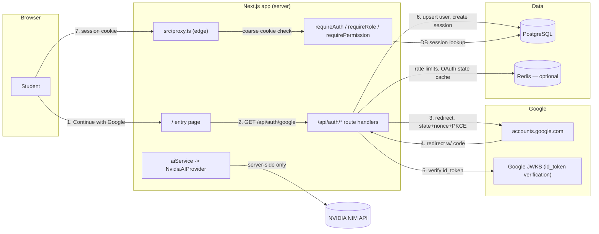
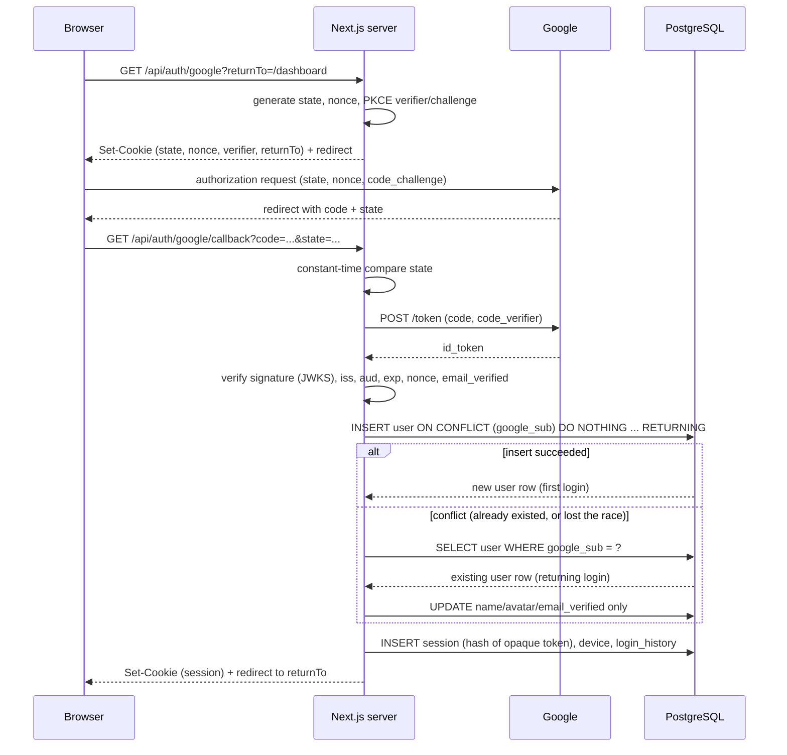

# Architecture

## System overview

## Request flow: first login vs. returning login

## Session model

IntelliHire uses a **single server-managed session**, not a JWT access token
+ refresh token pair:

- The browser holds one opaque, high-entropy, HttpOnly, Secure, SameSite=Lax
  cookie (`ih_session`).
- The database stores only `sha256(token)` — never the raw token — in
  `sessions.token_hash`, alongside `user_id`, `device_id`, `expires_at`, and
  `revoked_at`.
- Every authenticated request does a DB lookup (`getCurrentAuth()`) to
  confirm the session is unexpired, unrevoked, and its owning user is
  `ACTIVE`.
- `POST /api/auth/refresh` performs **sliding-window renewal** — it pushes
  `expires_at` forward while the session is still valid, so an active user
  is never logged out mid-session. There is no separate refresh token to
  rotate because there is no separate access token to expire quickly.

This was a deliberate simplification versus the access+refresh pattern
described in the original spec: a single opaque server session, checked
against the DB on every request, gives equivalent revocation guarantees
(instant, because every request re-checks the DB) with a smaller attack
surface (no refresh-token-family reuse-detection bookkeeping). If a future
requirement needs stateless verification (e.g. a separate API server that
can't reach the session DB), swap in short-lived JWT access tokens issued
alongside the session — the `sessions` table's `token_hash` +
rotation-ready shape already supports that without a schema change.

## Edge proxy vs. server-side authorization

`src/proxy.ts` runs on the Edge runtime, which cannot reach PostgreSQL. It
does one job: reject requests to `/dashboard/*` and `/admin/*` that have no
session cookie at all, redirecting to `/` with a safe `returnTo`. It is a
fast UX layer, not a security boundary — the actual authorization decision
(is this session valid? is this user active? does this user hold the right
role?) happens in `getCurrentAuth()` and the `require*` guards, which run
server-side per request against the database. Every API route and every
protected page calls one of these guards directly; none re-implement their
own auth check.

## Why Drizzle instead of Prisma

Prisma's CLI downloads a native query-engine binary from
`binaries.prisma.sh` on `generate`/`migrate`. In network-restricted CI
runners or sandboxes without that domain allowlisted, those commands fail
outright. Drizzle is pure TypeScript — `drizzle-kit generate` computes SQL
migrations by diffing the schema file, no binary download, no live DB
connection required to generate a migration. This project's initial
migration (`drizzle/0000_*.sql`) was generated and inspected this way.
